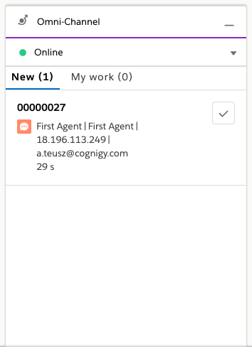

# Salesforce

Integrates Cognigy.AI with Salesforce (https://www.salesforce.com)

This module is based on jsforce (https://jsforce.github.io/)

### Secret (General)
This modules needs a CognigySecret to be defined and passed to the Nodes. The secret must have the following keys:

- username
- password
- token
- **optional**: loginUrl

If the loginUrl is stored in the secret, Salesforce login to this url, e.g. 'https://test.salesforce.com'

### Secret (Live Chat)
If one wants to use the **Start Live Chat** Node, another secret is required. The following keys need to be included:

- organizationId
  - Your Salesforce Organization ID
  - [How to find](https://help.salesforce.com/articleView?id=000325251&type=1&mode=1)
- deploymentId
  - The ID of your Salesforce Deployment
- livechatButtonId
  - The ID of your live chat button
- liveAgentUrl
  - The URL of your live agent

Please have a look at this tutorial in order to get all required values: [Get Chat Settings from Your Org](https://developer.salesforce.com/docs/atlas.en-us.noversion.service_sdk_ios.meta/service_sdk_ios/live_agent_cloud_setup_get_settings.htm)


# General

## Node: soqlQuery 

Takes a [SOQL query string](https://developer.salesforce.com/docs/atlas.en-us.soql_sosl.meta/soql_sosl/sforce_api_calls_soql.htm) and searches for the results in **Salesforce**. An example query would be the following: 

```sql
SELECT Firstname FROM CONTACT
```

The output will be a JSON that includes all firstnames from your Salesforce contacts: 

```json
"contacts": {
    "totalSize": 33,
    "done": true,
    "records": [
      {
        "attributes": {
          "type": "Contact",
          "url": "/services/data/v42.0/sobjects/Contact/..."
        },
        "FirstName": "Max"
      },
     
```

## Node: createEntity

All **Salesforce API Fields** are listed in the following PDF File: 
[Salesforce API Fields](https://resources.docs.salesforce.com/206/latest/en-us/sfdc/pdf/salesforce_field_names_reference.pdf)

### Entity: Event

Creates an **event** in the Salesforce calendar. The JSON in *record JSON* shows an example.

#### Record JSON

```json
{
  "Location": "Dusseldorf",
  "Description": "Eating Stones",
  "Subject": "Event X",
  "ActivityDate": "2019-01-25",
  "DurationInMinutes": "60",
  "ActivityDateTime": "2019-01-25T13:00:00"
}
```

### Entity: Contact

Creates a new **contact** in the **Contacts** Salesforce table. The JSON in *Record JSON* shows an example.

#### Record JSON

```json 
{
  "FirstName": "Max",
  "LastName": "Mustermann",
  "Phone": "0221 12345",
  "MobilePhone": "012345678912",
  "Email": "max.mustermann@mail.de",
  "Birthdate": "1994-10-14",
  "MailingCity": "Dusseldorf",
  "MailingStreet": "Speditionsstraße 1",
  "MailingState": "NRW",
  "MailingPostalCode": "40221",
  "MailingCountry": "Germany",
  "Description": "New Contact",
  "Department": "IT"
}
```

### Entity: Account

Creates a new **account** in the **Accounts** Salesforce table. The JSON in *Record JSON* shows an example.

#### Record JSON

```json
{
  "Name": "Company X",
  "Phone": "0221 12345",
  "BillingCity": "Dusseldorf",
  "BillingStreet": "Speditionsstraße 1",
  "BillingState": "NRW",
  "BillingPostalCode": "40221",
  "BillingCountry": "Germany",
  "Description": "New Contact",
  "Industry": "IT",
  "Website": "www.cognigy.com"
}
```

## Node: retrieveEntity

Retrieves the entity by searching for the given ID.

```json
{
 "sf_retrieve": {
     "attributes": {
       "type": "Account",
       "url": "/services/data/v42.0/sobjects/Account/0011t00000FIlUTAA1"
     },
     "Id": "0011t00000FIlUTAA1",
     "IsDeleted": false,
     "MasterRecordId": null,
     "Name": "My Account #1",
     "Type": null,
     "ParentId": null,
     "BillingStreet": null,
     "BillingCity": null,
     "BillingState": null,
     "BillingPostalCode": null,
     "BillingCountry": null
}

```

## Node: deleteEntity

Deletes an entity by ID. Specify the type of **entity**, such as **Contact**. The response looks like the following: 

```json
    "id": "0031t00000D508kAAB",
    "success": true,
    "errors": []
```

## Node: updateEntity

Updates an entity by ID and JSON arguments. The following code shows an example for updating a **Contact**:

```json
{
    "FirstName": "Peter", 
    "LastName": "Parker"
}
```

The response looks like the following: 

```json
    "id": "0031t00000D508kAAB",
    "success": true,
    "errors": []
```

# Service Cloud

The following Nodes provide various methods for the [Salesforce Service Cloud](https://www.salesforce.com/de/campaign/sem/service-cloud/).

## Node: Start Live Chat

This Node creates a new Salesforce Live Chat session and chat request. If it returned that `startedLiveChat` equals `true`, the live agent should received a chat request in the Salesforce Service Console:

```json
"liveChat": {
    "session": {
      "key": "ee809075-...KQt3Z98S+M=",
      "id": "ee809075-...377eaa4d11f0",
      "clientPollTimeout": 40,
      "affinityToken": "84aa1ta1"
    },
    "startedLiveChat": true
  }
```

Inside the **Salesforce Service Console**:



## Node: Check Live Agent Availability

Checks whether there is a free agent for the provided live chat button. It returns the following format:

```json
"available": {
    "messages": [
      {
        "type": "Availability",
        "message": {
          "results": [
            {
              "id": "5733f000000sdfgd",
              "isAvailable": true
            }
          ]
        }
      }
    ]
  }
```

In order to get the information, one has to turn on that an agent can **decline a chat request** in Salesforce:


## Node: Stop Live Chat

As soon as the user is finished with the agent conversation, this Node can be used to stop the curent live agent session. One needs the `liveAgentAffinity` and `liveAgentSessionKey` which were stored into the context before. After executing this Node, the Salesforce Live Agent chat will end and the Node will return `true`.

## Node: Send Message To Live Agent

In order to send a message to the current live agent session, this Node is required. One needs the `liveAgentAffinity` and `liveAgentSessionKey` which were stored into the context before -- by **Start Live Chat**. Furthermore, a `text` message must be defined. After sending a message, this node doesn't return anything.

## Node: Get Agent Message (BETA)

At the moment, one needs to use this Node in order to retreive sent agent messages. One needs the `liveAgentAffinity` and `liveAgentSessionKey` which were stored into the context before -- by **Start Live Chat**. Behind the scenes, this Node polls for a new Salesforce message and automatically sends it to the user as soon as it arrives.

In a Cognigy Flow, this process could look like this:

